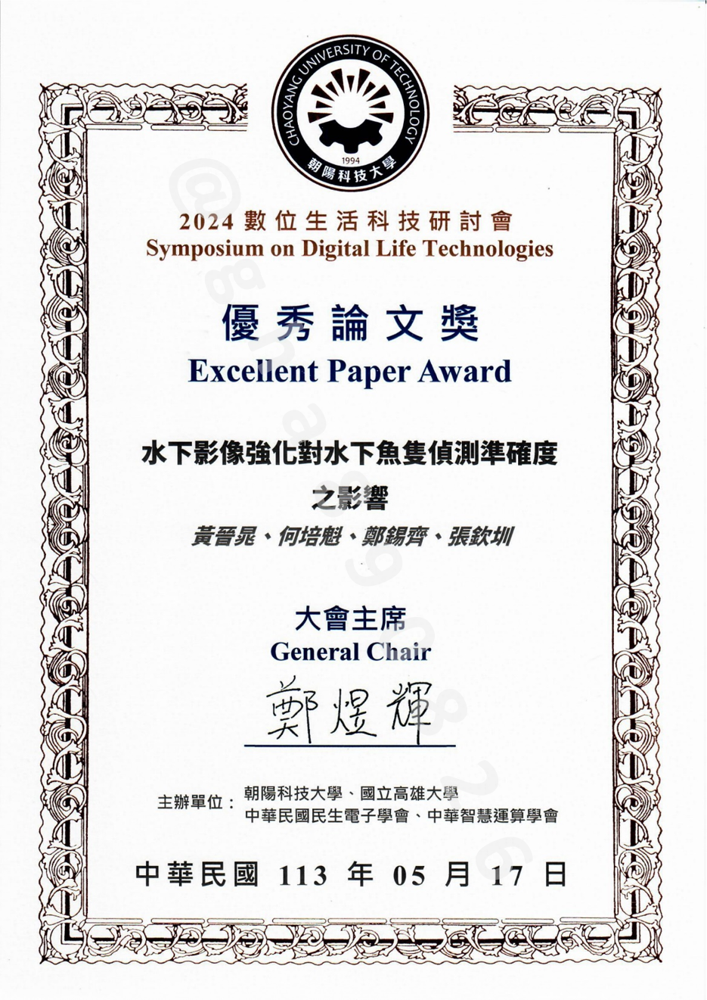
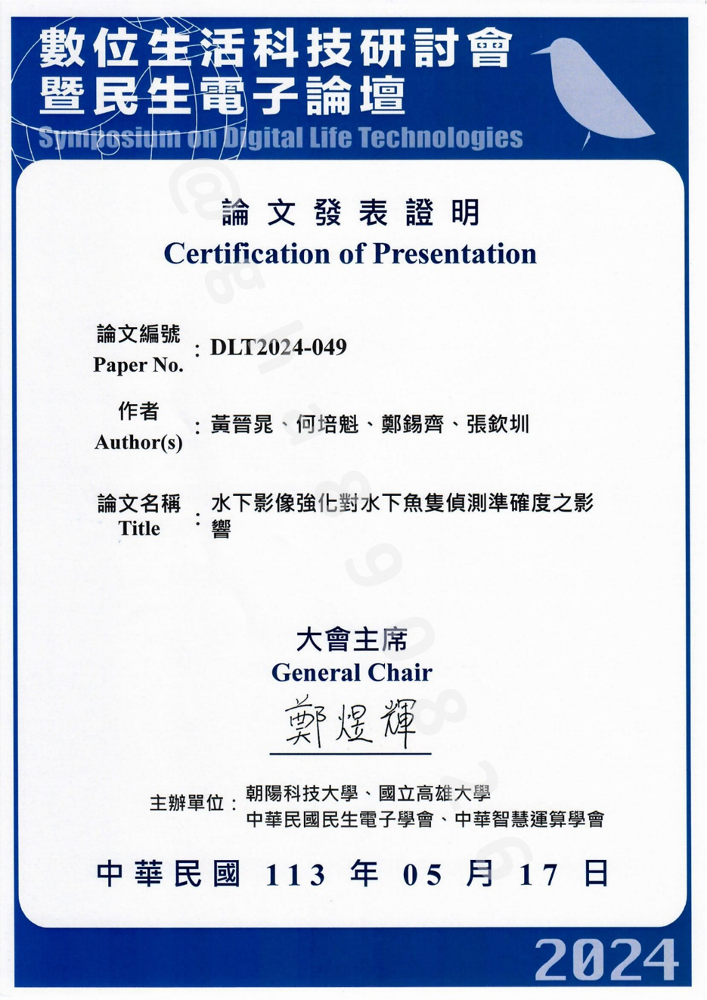

# 水下影像強化對水下魚隻偵測準確度之影響 DLT2024-049

## 摘要

智能化箱網養殖可有效提升漁業競爭力，但由於日夜與氣候的交替，光學相機會面臨進光亮與模糊等挑戰。為解決影像模糊等問題，使用深成對抗網路強化影像做為各項偵測前處理。結果顯示，使用強化影像相較於模糊影像，在體長估測將誤差降至10.9%，體重部分降至10.3%，驗證了使用GAN強化影像用於偵測的可行性。

關鍵字: 深度學習; 生成對抗網路; 水下影像; 影像強化; 智能化箱網養殖。

## 緒論

本文旨在於對水下影像強化前後的各項水下魚隻偵測結果進行比較，進而探討水下影像強化對於水下魚隻偵測準確度之影響。  
目前的光學影像於陸地上可完整且精準分析出圖片中的物件，但若要進行水下分析時除了防水的難題外更會面臨影像模糊而產生分析成效不佳的困境。為解決水下影像模糊問題，使用生成對抗網路(GAN)進行水下影像的強化，GAN可強化水下影像，令夜間光學影像轉換成日間，不但可使以水下影像為基礎的魚隻資訊分析更準確，更能讓光學影像於夜間也能進行分析。並與聲納結合，解決水下光學影像模糊問題。本文針對生成之強化影像與模糊影像進行偵測結果比較，希望可以驗證強化影像用於水下偵測應用的可靠性。  
本實驗在臺灣的魚隻養殖場域架設了多種傳感器，並由不同時間拍攝的影像中找出清晰及混濁的影像進行GAN的訓練。接著在魚隻偵測神經網路中，分別以GAN網路生成之強化影像及混濁或夜間的水下影像為輸入進行偵測結果比較。在各方面皆顯示由生成對抗網路生成的強化影像在偵測方面皆有較高的準確性。  
論文整體貢獻如下:

1. 修改並驗證了一個生成對抗網路模型強化水下影像，令夜間光學影像轉換成日間。  
2. 同時透過實際的場域實驗，對比有無使用生成強化影像的偵測結果，驗證使用生成強化水下影像作為辨識前處理之影響。  

## 結論

本論文透過對水生中心、室內養殖池和恆春海上箱網等場域拍攝的影像，實驗並建立了一個使用CycleGAN進行風格轉換的神經網路，該網路能夠成功地對水下影像進行強化。且針對強化影像進行了立體影像3D分析、實例切割、體長估測、體重估測以及魚隻數量分析的比較。  
首先，在立體影像3D分析方面，通過對強化影像和模糊影像生成的3D點雲進行比較，能夠清楚觀察到強化影像生成的3D點雲更為清晰，能夠更準確地辨識出魚鰭和花色等魚隻特徵。其次，在實例切割方面，使用了 Mask RCNN 網路進行實例分割，結果顯示強化影像在實例切割方面表現優於模糊影像。在體長估測和體重估測方面，分別使用立體影像進行了魚隻體長和體重的估算，結果顯示強化影像的分析結果優於模糊影像，在實驗中誤差率分別降低了3.6%及3.3%。最後，在魚隻數量分析方面使用了人工神經網路建立回歸模型，預測了各場域魚隻的實際數量，且與實際魚隻數量誤差值為3.3%以內。  
綜合以上實驗結果可以得出以下結論：影像強化技術能夠顯著提升水下魚隻分析的準確性和效率。透過增強影像的清晰度和邊界，可以更準確地進行魚隻的立體影像分析、實例切割、體長估測、體重估測以及魚隻數量分析，提供更準確的水下魚隻分析結果供養殖戶參考。養殖戶透過更精準的養殖分析，便能夠更精準的掌控實際養殖狀況，達到精準養殖，避免不必要的環境資源浪費。  
得益於影像處理技術的進步，許多相關應用都得以發展，而我們也將繼續探索和改進精準養殖的相關技術，以應對環境變遷等更多的挑戰，為相關領域的發展貢獻更多的力量。
